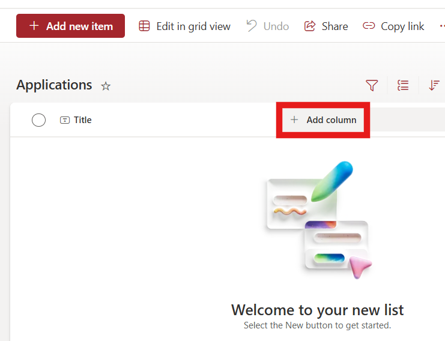
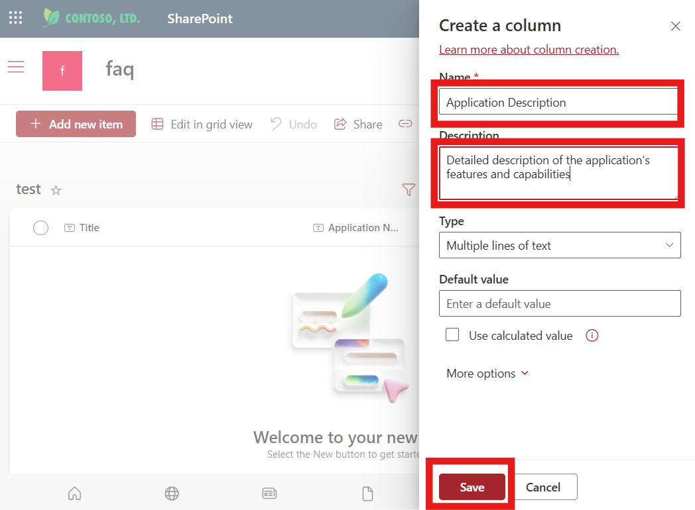
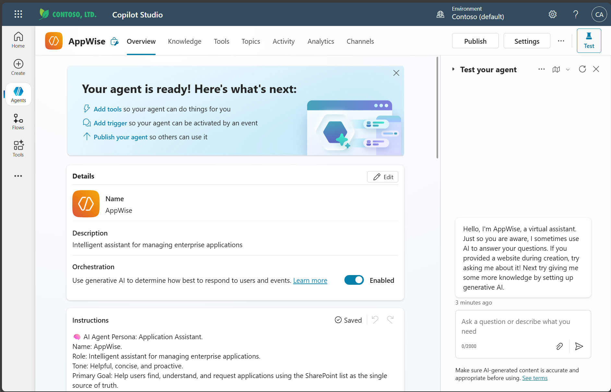

# Lab: Building AppWise – An Enterprise Application Management Agent in Microsoft Copilot Studio

## Table of Contents
1. Overview
2. Learning Objectives
3. Lab Scenario: Meet AppWise
4. Prerequisites
5. Part 1: Environment Setup and Access
6. Part 2: Creating Your First Agent
7. Part 3: Configure Tools (Actions) and SharePoint Integration
8. Part 4: Testing the Agent Logic
9. Part 5: Enable Application Request Submission (Create Item)
10. Part 6: Monitoring and Maintenance
11. Lab Completion Checklist
12. Troubleshooting Common Issues
13. Next Steps
14. Additional Resources

---

## Overview

In this lab, you will create **AppWise**, an intelligent AI agent for enterprise application management. This hands-on guide walks you through building an assistant that helps users discover, search, and request applications using SharePoint as the authoritative data source.

**Estimated Time**: 45-60 minutes  
**Difficulty Level**: Beginner to Intermediate  
---

## Learning Objectives

By the end of this lab, you will be able to:
* Build AppWise, a specialized enterprise application management agent
* Configure intelligent application search and discovery capabilities
* Implement semantic matching for application requests
* Create dynamic actions using SharePoint List connectors
* Integrate real-time data retrieval from SharePoint Lists
* Create a seamless application request workflow
* Test, deploy, and maintain your enterprise application assistant


---

## Lab Scenario: Meet AppWise

**AppWise** is your organization’s intelligent assistant for managing enterprise applications. As employees increasingly need various software tools, AppWise serves as the central hub for:

- **Discovering available applications** in your organization's approved software catalog
- **Searching by functionality** (e.g., "I need something for video editing")
- **Finding alternatives** when specific applications aren't available
- **Streamlining application requests** through a guided workflow
- **Maintaining governance** by using SharePoint as the single source of truth

AppWise embodies a helpful, concise, and proactive personality, ensuring users get quick answers while maintaining enterprise compliance through direct SharePoint List integration via Power Platform connectors.

---

## Prerequisites
**Important:**
Before starting, ensure you have:
* A Microsoft 365 account with access to Copilot Studio
* A SharePoint List containing your organization’s application data
* (Recommended columns: Application Name, Description, Business Justification, Requested By)
* Appropriate permissions to create agents and connect to SharePoint

---

## Part 1: Create the Required SharePoint Lists

Before beginning the AppWise agent configuration, you need to create two SharePoint Lists: one for the application catalog and another for application requests.

### 🧱  Step A: Navigate to SharePoint

1. Open your web browser
2. Navigate to your SharePoint site where you want to create the lists
   - Example: `https://yourcompany.sharepoint.com/sites/YourSiteName`
3. Sign in with your Microsoft 365 credentials if prompted

---
### 🧱  Step B: Create the Applications Catalog List

### Create the List
1. From your SharePoint site homepage, click **"New"** in the top navigation
2. Select **"List"** from the dropdown menu 

   
   
3. Choose **"List"** option

   
   
4. Configure the list:
   - **Name**: `Applications`

5. Click **Create**
     
     


### Add Required Columns for Applications List
The Applications list needs only one additional column (Application Name already exists by default as "Title"):

#### Column: Application Name
- Click **"+ Add column"**

    
  
- Select **"Text"**
- Click **Next**

    

- **Column name**: `Application Name`
- **Description**: `Name of the requested application`
- Click **"Save"**

    


#### Column: Application Description
- Click **"+ Add column"**

    
  
- Select **"Multiple lines of text"**
- Click **Next**

    
  
- **Column name**: `Application Description`
- **Description**: `Detailed description of the application's features and capabilities`
- Click **"Save"**

    

---
### 🧱  Step C:  Add Application Data

To properly test your AppWise agent, you need to populate the list with enterprise applications. You have two options:

### Option A: Quick Import (Recommended)
For faster setup, you can use SharePoint's Quick Edit feature:

1. Copy and paste the application names and descriptions from the [Applications.csv](https://github.com/luishdemetrio/AppWise-/blob/main/data/Applications.csv) file.
   - Open the applications.csv file in Excel.
   - Copy the rows values without the headers (from line 2)
     
       
     
2. In your Applications list, click **"Edit in grid view"** from the top menu

     
   
3. This opens a spreadsheet-like view where you can paste data directly

4. Ensure that the columns are in the same order of the excel file. You can drag and drop the columns' header to change their position.

5. Click on Add new item:
   
   
    
6. Click on the first empty field and paste the copied rows from Excel:

     

7. Click **"Exit grid view"** when finished to exit Quick Edit mode

     

>**💡 Tip**
>
>The Quick Edit method is much faster when adding multiple items at once.

### Option B: Manual Entry
Add each application manually by clicking **"+ Add new item"** for each item:

  

**Application 1:**
- **Application Name**: `M365 Copilot`
- **Description**: `M365 Copilot combines the power of large language models with your Microsoft 365 data to help you write, summarize, analyze, and automate tasks in Word, Excel, Outlook, and more—boosting productivity and decision-making across your workflow.`

  

**Application 2:**
- **Application Name**: `Adobe Reader`
- **Description**: `Adobe Reader for Teams enables seamless collaboration by allowing team members to view, comment on, and share PDFs securely across devices, streamlining document workflows and enhancing productivity in a shared workspace.`

**Application 3:**
- **Application Name**: `Copilot Studio`
- **Description**: `Microsoft Copilot Studio is a low-code platform to build AI-powered conversational agents that automate tasks, answer queries, and integrate with enterprise data like SharePoint, using generative AI for internal or external use.`

**Application 4:**
- **Application Name**: `Visual Studio 2022`
- **Description**: `Visual Studio 2022 is a 64-bit IDE for building, debugging, and deploying cross-platform apps for web, desktop, mobile, and cloud, with AI tools like GitHub Copilot, enhanced performance, and support for .NET, C++, Python, and more.`

**Application 5:**
- **Application Name**: `ClipChamp`
- **Description**: `Microsoft Clipchamp is a web-based video editing tool for creating professional videos with easy trimming, cropping, transitions, text, effects, and AI features like auto captions, and stock libraries for personal or business use.`


**Application 6:**
- **Application Name**: `Camtasia`
- **Description**: `Camtasia is a screen recording and video editing software used to create professional-quality tutorials, presentations, and demos by capturing on-screen activity and enhancing it with annotations, effects, and audio.`


**Application 7:**
- **Application Name**: `Microsoft Teams`
- **Description**: `Microsoft Teams is a collaboration platform that combines chat, video meetings, file sharing, and integrations with Microsoft 365 apps, helping teams stay connected and productive from anywhere.`


---
### 🧱  Step D: Create the Application Requests List

1. From your SharePoint site homepage, click **"New"** in the top navigation
2. Select **"List"** from the dropdown menu 

   
   
3. Choose **"List"** option

   
   
4. Configure the list:
   - **Name**: `Application Requests`
   
5. Click **"Create"**

### Add Required Columns for Application Requests List

### Column 1: Application Name
- Click **"+ Add column"**
- Select **"Single line of text"**
- **Column name**: `Application Name`
- **Description**: `Name of the requested application`
- Click **"Save"**

### Column 2: Description
- Click **"+ Add column"**
- Select **"Multiple lines of text"**
- **Column name**: `Description`
- **Description**: `Description of the requested application (auto-populated by agent)`
- **Type of text**: Select **"Plain text"**
- Click **"Save"**

### Column 3: Business Justification
- Click **"+ Add column"**
- Select **"Multiple lines of text"**
- **Column name**: `Business Justification`
- **Description**: `Business case and justification for why this application is needed`
- **Type of text**: Select **"Plain text"**
- Click **"Save"**

### Column 4: Requested By
- Click **"+ Add column"**
- Select **"Person or Group"**
- **Column name**: `Requested By`
- **Description**: `Person who requested this application`
- **Allow multiple selections**: Leave unchecked
- Click **"Save"**

---
### 🧱  Step E:  Note Your SharePoint Details

Before proceeding to Part 1, make sure to record:

- ✅ **SharePoint Site URL**: `https://yourcompany.sharepoint.com/sites/YourSiteName`
- ✅ **Applications List Name**: `Applications`
- ✅ **Application Requests List Name**: `Application Requests`
- ✅ **Permissions**: Ensure your account has read/write access to both lists

### Verification Checklist

Before moving to Part 1, verify:
- [ ] **Applications** list is created with Application Description column
- [ ] **Application Requests** list is created with all four required columns (Application Name, Description, Business Justification, Requested By)
- [ ] Applications catalog is populated with all 7 enterprise applications
- [ ] Application Requests list is empty (ready to receive new requests)
- [ ] You have the SharePoint site URL and both list names documented
- [ ] Your account has appropriate permissions to both lists

---

**⚠️ Important Notes**: 
- The **Applications** list serves as the catalog that AppWise searches through
- The **Application Requests** list will be automatically populated when users submit new requests through the agent
- Make sure both lists are accessible to users who will interact with the agent

---

## Part 2: Creating Your First Agent

### 🧱  Step 1: Access Microsoft Copilot Studio

1. **Navigate to Copilot Studio**
   - Open your web browser
   - Go to [Microsoft Copilot Studio](https://copilotstudio.microsoft.com)
   - Sign in with your Microsoft 365 credentials

2. **Verify Environment**
   - Ensure you're in the correct environment (typically your organization's tenant)
   - Check that you have the necessary permissions to create agents

3. **Explore the Interface**
   - Familiarize yourself with the main navigation menu
   - Note the different sections: Agents, Copilots, Knowledge, etc.
   
### 🧱  Step 2: Create a New Agent

1. **Start the Creation Process**
   - In the left-hand navigation pane, click on **Agents**.
   - Click the **+ New agent** button in the main panel.

     
   
   - On the Start building your agent screen, click the Configure button for manual configuration.
   
     


2. **Configure Basic Settings**
   - **Agent Name**: `AppWise`
   - **Description**: `Intelligent assistant for managing enterprise applications`
   - **Instructions**: 
     Copy and paste the following instructions:

    ```
    🧠 AI Agent Persona: Application Assistant.
    Name: AppWise.
    Role: Intelligent assistant for managing enterprise applications.
    Tone: Helpful, concise, and proactive.
    Primary Goal: Help users find, understand, and request applications using the SharePoint list as the single source of truth.
    
    Personality Traits:
    
    # Knowledgeable: Understands the structure and content of the SharePoint list;
    # Efficient: Prioritizes quick, relevant answers;
    # Empathetic: Guides users clearly when information is missing or ambiguous;
    # Precise: Only suggests truly relevant alternatives from the approved list;
    
    🛠 Agent Instructions:
    
    ### Action 1: Application Search:
    Trigger: User asks for an app by feature, task, or name.
    
    Steps:
    1. Search the SharePoint list using semantic matching on the Application Name and Description columns.
    2. Support synonyms and related terms. For example:
        a. "Making videos" → match "video editing", "video creation", "recording videos";
        b. "Presentations" → match "slides", "PowerPoint", "presenting";
    
    3. ✅ Only return applications that are actually present in the SharePoint list.
        - Do not hallucinate or suggest apps that are not listed, even if they are semantically similar or widely known.
        
        - Function-based matching rules:
           # For communication apps (like Skype) → look for other communication/messaging apps;
           # For design apps (like Photoshop) → look for other design/graphics apps;
           # For development apps (like VS Code) → look for other development/coding apps;
           # For productivity apps (like Notion) → look for other productivity/collaboration apps;
    
         a. ✅ Only suggest apps that serve the same core business function.
    
         b. ❌ Do NOT suggest apps just because they share generic keywords or descriptions.
    
         c. ❌ Relevance threshold: If no apps serve a truly similar function, proceed to step 5;
         
    
    4. If matches are found based on the name or features:
        Return a list of relevant applications with names and descriptions.
    
    5. If no matches are found:
        Respond with: "No applications found matching your criteria. Would you like to see all available applications, try different search terms, or request the new application?"
    
    
    
   ### Action 2: Request a New Application

    **Trigger:** User wants to request an application not currently listed.
    
    #### **Workflow Steps:**
    
    1. **Check if Application Name is Provided**
       - If not, ask:  
         `"Could you please provide the name of the application you'd like to request?"`
    
    2. **Search the SharePoint List for the Application**
       - If the app **exists**:
         - Respond:  
           `"The application [App Name] is already available. Here are the details: [App Description]."`
         - **Do not proceed to create a request.**
    
       - If the app **does not exist**:
         - Respond:  
           `"The application [App Name] is not currently listed in our approved applications."`
    
    3. **Check for Functionally Similar Applications**
       - Use the [Action 1: Application Search] to semantic matching to find apps with the same primary function.
       - If **similar apps are found**:
         - Respond:  
           `"However, these similar applications are available: [List of Similar Apps with Brief Explanations]. Would any of these meet your needs, or do you still want to request [App Name]?"`
         - **Wait for user response.**
           - If the user chooses a similar app, provide its details and end the flow.
           - If the user insists on the new app, continue to the next step.
    
       - If **no similar apps are found**:
         - Respond:  
           `"No similar applications are available. Would you like to proceed with a request for [App Name]?"`
         - **Wait for user confirmation.**
    
    4. **Collect Business Justification**
       - If the user confirms they want to request the new app:
         - Ask:  
           `"Could you please provide a business justification for requesting [App Name]? This will help us process your request."`
         - **Wait for user input.**
    
    5. **Create the Application Request**
       - After receiving the justification, use the “Create Item” action to submit the request to SharePoint.
       - Respond:  
         `"Thank you! Your request for [App Name] has been submitted. The IT team will review your request and follow up with you soon."

    ```

   
3. **Create the agent**

    - Click **Continue** to create the agent.

      
   

### 🧱 Step 3: Agent Overview Page

Once your agent is created, you’ll land on the Agent Overview page.

Here’s what you’ll see:

- ✅ A confirmation message: “Your agent is ready!”
- 🛠 Suggestions for next steps:
  - Add tools so your agent can perform actions.
  - Add triggers to activate your agent based on events.
  - Publish and share your agent when it’s ready.

You’ll also have access to the following configuration sections:

- **Details:** Displays the agent’s name and description.
- **Orchestration:** Toggle generative AI orchestration on or off.
- **Instructions:** Shows the guidance you provided for how the agent should behave.

  

This is your central hub for managing and evolving your agent.

---

## Part 3: Configure Tools (Actions) and SharePoint Integration

### 🧱 Step 4: Create SharePoint List Tool

1. **Navigate to Tools**

   - Click on the **Tools** tab in your agent or scroll down on the agent overview page until you find the Tools section.
  
   - Click on **+ Add tool**.

     


2. **Configure SharePoint List Connector**

   - Search for `SharePoint List` from the search box and **press enter**.
   
   - Select **Get items** action.

     
  
3. **Configure the connection:**

   - Add a new connection in case you are not signed yet.

   - Click on **Add and configure**.

     

   - You will redirected to the connector configuration page.

     


4. **Configure the connector**

   - Provide a better **name** and **description**:
     - **Name:** `Get applications`
     - **Description:** `Get applications from the Applications SharePoint list`
     - **Site Address:** `Your SharePoint site URL`
     - **List Name:** 
       - **Fill using:** Change the value from **Dinamically fill with AI** to `Custom value`.
       - **Value:** Select your applications list
  
   - Click on **Save**.

     
  


### 🧱 Step 6: Test Tools Integration

1. **Open the Test your agent Panel**

   - If the **Test your agent** panel is not already visible, go to your agent’s overview page and click the **Test your agent button** in the top-right corner.
  
   - This will open a side panel where you can simulate user interactions and test your agent’s behavior in real time.

2. **Run a Basic Query**

   - In the test input box, type: 

     `Show me available applications`

   - Press **Enter** to submit the query.

   - In the **Activity Map**, observe that the agent is using the **Get items** connector to retrieve application data from SharePoint.

     

3. **Connect to SharePoint**

   - Since this is your first interaction using the SharePoint connector, you’ll be prompted to connect your account.

   - Click **Connect**.

     
  
   - On the Manage your connections page, click **Connect** again.

     
  
   - In the Create or pick a connection:

     - **Sign in** with your Microsoft 365 account.
     - Click **Submit**.
  
       
  
   - Ensure your connection status shows **Connected**, then return to Copilot Studio.

     
  
4. **Retry the Query**

   - Back in the Test your agent panel, click **Retry** to resubmit your previous prompt.

     

5. **Verify the Response**

   - Confirm that the agent successfully retrieves and displays application data from the SharePoint list.

     

---

## Part 4: Testing the Agent Logic

### 🧱 Step 7: Initial Testing

1. **Open the Test Panel**
   - On your agent’s overview page, click the **Test your agent** button.
   - This opens the test chat interface where you can simulate user interactions.

2. **Perform a Basic Scenario Test**

   - In the test input box, **type**:
   
     `I would like to request a new app for editing videos`
   
   - Press **Enter** to submit the query.
   
3. **Expected Behavior**

- The agent should:
  - Recognize the intent to request a new application.
  - Perform semantic matching based on the phrase “editing videos.”
  - Return a list of relevant applications from the SharePoint list.
   
   
4. **Expected Result**

   - You should see two applications returned: ClipChamp and Camtasia, both of which are associated with video editing functionality.
   
     
  
   
### 🧱 Step 8: Test Functional Alternatives for Unavailable Applications

1. **Test Scenario: Requesting an Unlisted Application**

   - In the test input box, type:

     `Is Skype available?`

   - Press **Enter** to submit the query.

2. **Expected Behavior**

   - Since Skype is not listed in the SharePoint applications list, the agent should:

     - Search for Skype in the SharePoint list and confirm it is not available.
     - Use semantic matching to identify applications that serve a similar function.
     - Suggest Microsoft Teams as a functionally equivalent alternative.
  
3. **Expected Response**

   - The agent should respond with something like:

     ```
     Skype is not currently listed in our approved applications. However, Microsoft Teams is available. It’s a collaboration platform that combines chat, video meetings, file sharing, and integrations with Microsoft 365 apps, helping teams stay connected and productive from anywhere.

     Would you like to proceed with Microsoft Teams, or would you like to request Skype as a new application?”
     ```

     
     

4. **Validation**

    - Confirm that the agent:
        - Does not hallucinate or suggest unlisted apps.
        - Provides a clear and relevant alternative based on function.
        - Offers the user a choice to proceed with the alternative or request the original app.

 

### 🧱 Step 9: Test Request Flow for an Unavailable Application

1. **Test Scenario: Ask for an Unlisted App**

   - In the test input box, type:
     
     `Is Skype available?`

   - Press **Enter** to submit the query.

2. **Expected Behavior**

   - The agent should:
   
     - Search the SharePoint list and confirm that Skype is not listed.
     - Use semantic matching to identify a functionally similar application.
     - Suggest Microsoft Teams as an alternative, with a brief explanation of its capabilities.
     
3. **Expected Response**
     
     ```
     Skype is not listed in the SharePoint applications list. However, Microsoft Teams is available, which is a collaboration platform that combines chat, video meetings, file sharing, and integrations with Microsoft 365 apps, helping teams stay connected and productive from anywhere.
    
     Would you like to proceed with Microsoft Teams, or would you like to request Skype as a new application?
    ```
    
4. **User Follow-Up**
    
   - In the test panel, respond with:
   
     `I would like to request Skype as a new app`
     
5. **Expected Agent Prompt**
    
     ```
     Could you please provide a business justification for requesting Skype as a new application? This will help in processing your request.
     ```


6. **Validation**

   - Confirm that the agent:

     - Follows the correct fallback logic when the app is not found.
     - Suggests a relevant alternative based on function.
     - Initiates the request workflow when the user insists on the original app.
     - Asks for a business justification as defined in the agent instructions.

   
   
#### ⏭️ What’s Next?


In the next section of this lab, you’ll learn how to extend AppWise’s capabilities by adding a Connector that allows the agent to create new application requests directly in the SharePoint List. This will complete the end-to-end workflow from discovery to request submission.

---

## Part 5: Enable Application Request Submission (Create Item)

### 🧱 Step 10: Add the “Submit Application Request” Topic in Copilot Studio


1. **Navigate to Topics**
   - Go to the Topics tab in the left navigation menu.
   
     

2. **Create a New Topic**

   - Click **+ Add topic** and select **From blank**.
   
     
     
   - Click on **Untitled** and enter the Topic name: `Submit Application Request`
   
     
   
   - Enter the Description:

     `This topic is used exclusively by the AppWise agent to submit a new application request to the IT team after the user has confirmed their intent and provided a business justification. It should only be triggered by the agent as the final step in the application request workflow, never directly by the user.`


   - Click **Save**.
   
     

### 🧱 Step 11: Add Input Variables to a Topic

1. **Go to Topic Details**
   - At the top or side of the topic editor, click on **Details**.

2. **Open the Input Tab**
   - In the Topic Details pane, select the **Input** tab.  
     This is where you define variables that the topic can receive from other topics or actions.

3. **Create a New Variable**
   - Click on **Create a new variable**.
   
     
     
   - Fill in the details for your first variable:
     - **Variable name:** `applicationName`
     - **Description:** `It is the name of the application that user is requesting.`

4. **Add Another Variable**
   - Click **Create a new variable** again.
   - Fill in the details for your second variable:
     - **Variable name:** `businessJustification`
     - **Description:** `It is the business justification for requesting the application.`

5. **Save Your Changes**
   - Make sure to save or apply your changes before leaving the page.

   
   

**Result:**  
Your topic now has two input variables:
- `applicationName` — the name of the requested application
- `businessJustification` — the user’s reason for requesting it

These variables can now be passed into the topic from your main workflow, ensuring the topic is actionable only when the agent has collected all required information.

---


### 🧱 Step 12: Ask for User Confirmation Before Submitting the Request

1. **Add an Ask a Question Node**

   - Click the **+** icon after the previous node
   
     
     
   - Select **Ask a question** from the menu.
    
     
     
   - In the question field, enter your confirmation message, for example:

     ```
     You are about to request the application: .
     Business justification: "
        
     Do you want to proceed with submitting this request?
     ```


2. **Compose the Confirmation Message with Variables**

   - In the **Ask a question** node, click in the message area where you want to insert the application name (for example, after “application:”).
   
   - Click the **Insert variable ({x})** button in the toolbar.
   
   - From the list, select the variable **applicationName**. This will insert the variable at your cursor position.
   
     
   
   - Click in the message area where you want to show the justification (for example, after “Business justification:”).
     
   - Click the **Insert variable ({x})** button again and select **businessJustification**.
  
   - Your message should look like this:
    
     
    
   - This will ensure the confirmation prompt is personalized with the user’s actual input.


3. **Add User Response Options**

   - Click on **+ New Option** to add two buttons or quick replies.
   
     
   
   - Add the following choices:
   
     - **Yes, submit request**
     - **No, cancel**
   
     

4. **Rename the User Response Variable**

  - Click on the variable name (e.g., Var1) and rename it to ConfirmAppRequest.
  
    

---

### 🧱 Step 13: Add a Condition Node

1. **Add a Condition**

   - Click the **+** icon after the **Ask a question** node.
   
   - Select **Add a Condition** from the menu.
   
     

2. **Configure the condition**     

   - In the condition setup, select the variable you used for the confirmation (e.g., ConfirmAppRequest).
   
     

   - Set the condition to check if the user’s response is Yes, submit request.
   
     


---

### 🧱 Step 14: Handle the “Yes, submit request” Outcome

1. **Add the Create Item Connector**

   - Under the **Yes, submit request** branch of your condition:
     - Click the **+** icon to add a new node.
     - Select **Add a tool**.
     - Go to the **Connector** tab.
     - In the search box, type SharePoint List.
     - Select the **Create Item** action for SharePoint.
     
     
     
2. **Configure the connection**

   - If prompted, sign in with your Microsoft 365 account to authenticate the SharePoint connection.
   - After signing in, click Submit to establish the connection.
   
      

   - After connecting, you’ll see the **Create item** node added to your flow.
   
3. **Map the Required Fields**
   
   - Click on the ellipses (three dots) on the Create item node and select Properties to open the configuration panel.

     
   
   - In the Properties panel, go to the **Inputs** tab.

   - Fill in the SharePoint Site Address and List Name.

     - Locate the fields for Site Address and List Name.
     - For **Site Address:**
       - Enter the full URL of your SharePoint site (e.g., https://yourcompany.sharepoint.com/sites/YourSiteName).
     
     - For **List Name:**
       -Enter the exact name of your SharePoint list where you want to store the application requests (e.g., Application Requests).
     
     

4. **Map the Advanced Parameters**

   - In the Properties panel, scroll down and expand **Advanced parameters (40)** to access additional fields.

   - Locate the fields **Application Name**, **Business Justification**, and **Request By**.

   - For **Business Justification:**
     - Click the ellipses (three dots) next to the field.
       
     - In the dialog that appears, select the variable **businessJustification** from the list.
     
     
       
   - For **Application Name:**
     - Click the ellipses (three dots) next to the field.
       
     - In the dialog that appears, select the variable **applicationName** from the list.
     
   
     
   
   - For **Requested By:**
     - Click the ellipses (three dots) next to the field.
     - In the dialog that appears, go to the **System** tab and select the variable **User.Email** from the list.
     
     
   
5. Ensure all required fields are mapped to the correct variables before proceeding.

   
   

6. **Add an Email Notification Step**

   - After ensuring all required fields are mapped and the **Create Item** node is configured, click the **+** icon after the Create Item node to add a new node.
   
   - Select **Add a tool**.

   - Go to the **Connector** tab.
   
   - In the **search box**, type `Outlook send an email`.
   
   - Select **Send an email (V2)** from the list of available actions.

   
   

7. **Configure the connection**

   - If prompted, sign in with your Microsoft 365 account to authenticate the Send an email(V2) connection.
   
   - After signing in, click Submit to establish the connection.
   
     

   - After connecting, you’ll see the **Send an email(V2)** node added to your flow.
   
     
   

8. **Configure the Email Notification**

   - After adding the **Send an email (V2)** node, click on it to open the properties panel.
   
   - In the Properties panel, go to the **Inputs** tab.
   
   - Fill in the required fields:
     
     - **To:**
       - Click the ellipses (three dots) next to the field.
       - Go to the **System** tab.
       - Select the variable **User.Email**.
     
           
       
     - **Subject:**
       
       - Click the ellipses (three dots) next to the field.
       - Go to the **Formula** tab.
       - Click on the expand icon.
       
      
           
         
       - Enter the formula:
       
         `Concatenate("Confirmation: Your Application Request for ", Topic.applicationName)`
         
       - Ensure that there are no errors and click **Insert**.
       
           
       
        
     - **Body:**

       - Compose the email body. Use the variables **applicationName** and **businessJustification** to personalize the message.
       
         ```
         Hello,
    
         This is to confirm that your request for the application "{Topic.applicationName}" has been submitted successfully.
    
         Business Justification: {Topic.businessJustification}
    
         The IT team will review your request and follow up with you soon.
    
         Thank you!
         ```
       
       - Click the **Insert variable ({x})** button to add the variables.
       
           

       - (Optional) If you want to notify additional recipients (such as IT admins), you can add their emails in the CC or BCC fields.
       
       - Click **Save** to apply your changes.

   
   
9. **Add a feedback message**

   - After the Send an email(V2) node, click on the button **+** and select **Send a message**.
   
       
     
   - Add a message to confirm submission to the user. For example:
   
     ```
     Your request for {Topic.applicationName} has been submitted. The IT team will review your request and follow up with you soon.
     
     If you have any further questions or requests, feel free to ask!
     ```
       
     
   - This message will be shown to the user in the chat as confirmation that their request was successfully submitted.

---

### 🧱 Step 15: Handle the “No, cancel” Outcome

When a user decides not to proceed with submitting an application request, it’s important to provide clear feedback and keep the conversation open for further assistance.

1. **Add a Request Cancelled Message**

   - Under the **All other conditions** branch (the path triggered when the user selects “No, cancel”), click the **+** button and choose **Send a message**.
   
       

   - Enter a message to inform the user that their request has been cancelled. For example:

     ```
     ❌ Request cancelled. If you need anything else or want to start a new request, just let me know!
     ```

     
   - 📢 Tip: Adding a visual cue (like an emoji) and a gentle prompt encourages users to continue interacting if they wish.

     
       


2. (Optional) Offer Next Steps

   - You can further enhance the user experience by suggesting what they can do next. For example:
    
     ``` 
     Request cancelled. Would you like to:
     - See all available applications?
     - Start a new application request?
     - Restart the chat?
     ```

  - This keeps the conversation user-centric and proactive.

---

### 🧱  Step 16: Test the End-to-End Application Request Flow

Testing your agent’s full workflow ensures that users can successfully request new applications, receive confirmation, and that all backend processes (SharePoint and email) work as intended.

1. **Open the Test Panel**
   - Navigate to **Test your agent** in Copilot Studio.
   - Click the **🔃 Restart**  button to begin a fresh conversation..
   
       


2. **Simulate an Application Request**
   
   **User:**  
    `I want to request Zoom as a new application`
    
    **Agent (Expected):**  
    ```
    The application Zoom is not currently listed in our approved applications. However, Microsoft Teams is available, which also serves as a communication and video conferencing tool. Here are the details:

    Microsoft Teams: Microsoft Teams is a collaboration platform that combines chat, video meetings, file sharing, and integrations with Microsoft 365 apps, helping teams stay connected and productive from anywhere.

    Would Microsoft Teams meet your needs, or do you still want to request Zoom?
    ```
    
      
    
    **User:**  
    `We need Zoom for external client meetings that require this platform.`
    
    **Agent (Expected):**  
   ```
   You are about to request the application: Zoom.

   Business justification: We need Zoom for external client meetings that require this platform..

   Do you want to proceed with submitting this request?
   ```
   
     
   
   **User:**  
   `Yes, please`
   
   **Agent (Expected):**  
   ```
   Your request for Zoom has been submitted. The IT team will review your request and follow up with you soon.

   If you have any further questions or requests, feel free to ask!
   ```

     
   
3. **Verify Email Confirmation**
   - Check your inbox for a confirmation email regarding your application request.

   - Ensure the email contains:
   - The correct application name (“Zoom”)
   - The business justification you provided
   - A clear confirmation message
   
       
   
4. **Verify SharePoint Submission**
   - Open your Application Requests SharePoint list.

   - Confirm that a new item appears with:
     - Application Name: Zoom
     - Business Justification: (your provided reason)
     - Requested By: (your email address)
     
   - Check that all required fields are correctly populated.
   
        

5. **Validate the User Experience**
   - Ensure the agent:
     - Collects all required information (application name and business justification)
     - Offers a relevant alternative if available
     - Submits the request only after user confirmation
     - Sends a confirmation email
     - Provides a clear, friendly confirmation message in the chat


6. **(Optional) Test Cancellation Flow**

   - When prompted to confirm the request, select No, cancel.
   - Verify that the agent responds with a cancellation message and does not submit a request or send an email.
   
7. **Troubleshooting Tips**
   - If the request does not appear in SharePoint, check connector configuration and permissions.
   - If no email is received, verify the Outlook connector and spam/junk folders.
   - If the agent does not prompt for justification, review the topic flow and variable mapping.

---

### 🧱 Step 17: Refine Agent Behavior

1. **Analyze Test Results**
   - Identify areas where responses could be improved
   - Note any instances where the agent provided irrelevant suggestions

2. **Update Instructions** (if needed)
   - Return to the **"Instructions"** tab
   - Make adjustments based on your testing
   - Common adjustments:
     - Clarify response format
     - Add more specific examples
     - Adjust tone or personality traits

3. **Retest Critical Scenarios**
   - Focus on the scenarios that previously had issues
   - Verify improvements are working as expected

---

## 🏁 You’re Done!

You’ve now built an end-to-end workflow:
- **Discovery** → **Alternative Suggestion** → **Request Submission**  
All powered by Copilot Studio, Outlook and SharePoint.

---

## Part 5: Publishing and Deployment

### 🧱  Step 18: Prepare for Publishing

1. **Final Review**
   - Review all agent settings
   - Verify instructions are complete and accurate
   - Test one final round of scenarios

2. **Configure Publishing Settings**
   - Navigate to **"Settings"** or **"Deploy"** section
   - Choose deployment options:
     - Internal use only
     - Specific users/groups
     - Organization-wide

### 🧱  Step 19: Publish Your Agent

1. **Publish the Agent**
   - Click **"Publish"** or **"Deploy"**
   - Follow the publishing wizard
   - Configure any required approvals or permissions

2. **Test Published Version**
   - Access your agent through the published interface
   - Verify it works the same as in the test environment

3. **Document Access Information**
   - Note the agent's URL or access method
   - Share instructions with intended users

---

## Part 6: Monitoring and Maintenance

### 🧱  Step 20: Monitor Agent Performance

1. **Review Analytics** (if available)
   - Check usage statistics
   - Review conversation logs
   - Identify common user queries

2. **Gather Feedback**
   - Collect user feedback on agent performance
   - Note frequent issues or requests for improvement

### 🧱  Step 21: Iterate and Improve

1. **Regular Updates**
   - Update knowledge base as applications change
   - Refine instructions based on user interactions
   - Add new capabilities as needed

2. **Version Control**
   - Keep track of changes made to your agent
   - Document major updates and their purposes

---

## Lab Completion Checklist


- [ ]  Successfully accessed Microsoft Copilot Studio and verified environment/permissions
- [ ]  Created a new agent with proper configuration and naming conventions
- [ ] Added comprehensive, clear instructions for the Application Assistant persona and logic
- [ ] Configured SharePoint List actions using the Get Items connector
- [ ]  Set up the GetApplicationList action with correct site and list parameters
- [ ]  Tested agent’s ability to retrieve and display real-time data from SharePoint Lists
- [ ]  Implemented and tested semantic search and alternative suggestion logic
- [ ]  Built and validated the end-to-end application request workflow (including business justification collection)
- [ ]  Configured the Create Item connector for submitting requests to SharePoint
- [ ]  Set up and tested automated email notifications for request confirmations
- [ ]  Verified cancellation and fallback flows (e.g., user cancels request, no matching apps found)
- [ ]  Conducted thorough scenario-based testing (including edge cases and error handling)
- [ ]  Refined agent behavior and instructions based on test results and user feedback
- [ ]  Published the agent for use and configured deployment settings (audience, permissions)
- [ ]  Documented access, usage instructions, and support contacts for end users
- [ ]  Established a plan for ongoing monitoring, analytics review, and iterative improvements

## ⭐ Optional Enhancements
- [ ]  Added approval workflow integration (e.g., Power Automate or custom logic)
- [ ]  Provided multi-language support or accessibility features
- [ ]  Integrated additional data sources or connectors as needed
- [ ]  Created user training materials or quick-start guides
- [ ]  Set up regular review meetings for agent performance and feedback

---

## Troubleshooting Common Issues

### 🪲 Issue 1: Agent Not Responding to Instructions

**Possible Causes & Solutions**: 
- Ensure your agent instructions are saved and up to date in the agent configuration.
- Check for syntax errors or missing logic in your Instructions or Topic flows.
- Confirm that the correct Topics are triggered by your test phrases.
- Make sure your Tools (Power Platform connectors) are properly configured and enabled.

### 🪲 Issue 2:  Irrelevant or Missing Application Suggestions
**Possible Causes & Solutions**: 
- Review and strengthen your semantic matching logic in the agent instructions and Topic flows.
- Add more specific examples or synonyms to improve matching accuracy.
- Ensure your SharePoint List contains up-to-date and well-described application data.
- Test with a variety of user queries, including edge cases, to identify and fix pattern issues.

### 🪲 Issue 3: Connector or Data Retrieval Problems
**Possible Causes & Solutions**: 
- Verify your SharePoint List connector is authenticated and connected.
- Double-check the Site URL and List Name in your connector configuration.
- Ensure your Microsoft 365 account has the necessary permissions to access and modify the SharePoint List.
- Test the connector with sample data to confirm it retrieves items as expected.
- If using dynamic fields, ensure variable mapping is correct in your Topic and Tool configurations.

### 🪲 Issue 4: Application Requests Not Being Submitted
**Possible Causes & Solutions**: 

- Confirm the Create Item connector is set up with the correct SharePoint List and field mappings.
- Check that all required variables (e.g., applicationName, businessJustification) are being passed to the connector.
- Make sure the request flow in your Topic is not being interrupted by missing or invalid user input.
- Review the flow for any conditions or branches that might prevent submission.

### 🪲  Issue 5: Email Notifications Not Sent
**Possible Causes & Solutions**: 

- Ensure the Outlook Send an Email (V2) connector is authenticated and configured.
- Verify the recipient email address is correctly mapped (e.g., using the User.Email variable).
- Check for errors in the email body or subject formula.
- Look in your spam/junk folder if the email does not appear in your inbox.

>🧩 Tip:
For any persistent issues, use the Test your agent panel and the activity map to trace the flow of actions, variable values, and connector calls. This can help pinpoint where the process is breaking down.
---

## ⏩ Next Steps

After completing this lab, consider exploring:

- **Advanced Agent Customization**
  - Refine agent personality, tone, and response logic for your organization’s unique needs
  - Add conditional branching, richer prompts, or adaptive cards for enhanced user experience

- **Integration with Other Microsoft 365 Services**
  - Connect your agent to Teams, Outlook, Planner, or OneDrive for broader workflow automation
  - Trigger Power Automate flows for approvals, notifications, or escalations

- **Custom Connectors and Data Sources**
  - Build custom connectors to integrate with external APIs, databases, or legacy systems
  - Expand your agent’s reach beyond SharePoint to other business-critical platforms

- **Analytics and Reporting**
  - Use built-in analytics to monitor agent usage, satisfaction, and common requests
  - Export conversation data for deeper analysis and continuous improvement

- **Multi-language and Accessibility Support**
  - Enable your agent to support multiple languages for a global workforce
  - Ensure accessibility by following Microsoft’s inclusive design guidelines

- **Security and Compliance Enhancements**
  - Review and enforce data privacy, retention, and access policies
  - Audit connector permissions and agent actions regularly

- **User Training and Adoption**
  - Create quick-start guides or video tutorials for end users
  - Gather feedback and iterate based on real-world usage

---

**Tip:**  
Stay up to date with new Copilot Studio features and best practices by following Microsoft Copilot Studio Documentation and the Power Platform Blog.


---

## ➕ Additional Resources

- [Microsoft Copilot Studio Documentation](https://learn.microsoft.com/en-us/microsoft-copilot-studio/)
- [SharePoint Integration Guide](https://docs.microsoft.com/en-us/power-virtual-agents/sharepoint-integration)

